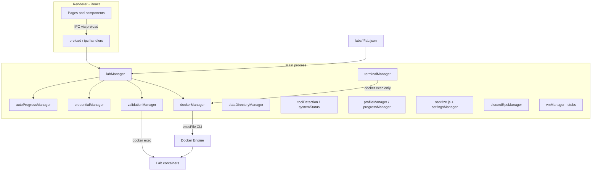

# Architecture

Computer Server Labs is an **Electron** desktop app with a **React** UI, **Node.js** main process, and **Docker CLI** integration for labs. Target platforms: **Windows 10/11** and **Linux desktop** (no macOS yet).

License: **MPL-2.0** for source in `src/`.

---

## High-level diagram



---

## Process model

| Layer | Path | Role |
|-------|------|------|
| Main | `src/main/` | Window, IPC, Docker, labs, validation, file I/O |
| Preload | `src/main/preload.js` | `contextBridge` API; no Node in renderer |
| Renderer | `src/renderer/` | UI, fictional terminal ambience, dashboards |

**Security:** `contextIsolation: true`, `nodeIntegration: false`.

---

## Key modules (main process)

| Module | Status | Responsibility |
|--------|--------|----------------|
| `main.js` | Active | App lifecycle, window, icon, IPC registration |
| `preload.js` | Active | Expose `window.api` |
| `ipc/handlers.js` | Active | IPC channel handlers |
| `toolDetection.js` | Active | Docker, WSL, VirtualBox, etc. |
| `systemStatus.js` | Active | Aggregate health snapshot for UI |
| `labScanner.js` | Active | Count `labs/*/lab.json` |
| `profileManager.js` | Active | Local profile JSON in userData |
| `discordRpcManager.js` | Stub | RPC connect in Phase 9 |
| `dockerManager.js` | Active | pull/build/run/stop/exec via Docker CLI |
| `labManager.js` | Active | Load lab.json (AJV), orchestrate Docker sessions |
| `validationManager.js` | Active | Whitelisted checks via `docker exec` |
| `dataDirectoryManager.js` | Active | userData layout, `DATA_FOLDER.txt`, reset |
| `credentialManager.js` | Active | Per-session lab passwords (never logged) |
| `autoProgressManager.js` | Active | Objective auto-checks during sessions |
| `terminalManager.js` | Active | Integrated terminal via `docker exec` only |
| `progressManager.js` | Active | SQLite XP, completions, achievements |
| `settingsManager.js` | Active | User settings in SQLite (Safety Mode default ON) |
| `safetyManager.js` | Partial | Safety checks in `sanitize.js` + schema |
| `vmManager.js` | Stub | Future VirtualBox/VMware/Hyper-V/KVM ([vm-rdp-viewer.md](vm-rdp-viewer.md)) |

---

## Data storage

| Data | Location |
|------|----------|
| User profile, XP, settings | `app.getPath('userData')` |
| Lab profile & activity | `userData/profile/` |
| Session credentials | `userData/sessions/` (deleted on lab stop) |
| SQLite progress | `userData/progress.db` (created at runtime; never bundled) |
| Folder guide | `userData/DATA_FOLDER.txt` |
| Lab definitions | `labs/` in dev; `process.resourcesPath/labs/` when packaged |
| Defaults & schema | `config/` in dev; `process.resourcesPath/config/` when packaged |
| Bundled docs | `docs/` in dev; `process.resourcesPath/docs/` when packaged |
| Icons | `assets/` or `resources/` in dev; `process.resourcesPath/assets/` when packaged |

Path resolution lives in `src/main/utils/paths.js` (`getProjectRoot`, `getLabsPath`, `getConfigPath`, `getDocsPath`, `getUserDataFile`).

The app **must not** write outside `userData` and Docker objects it creates for labs.

---

## Packaging (Phase 12)

Configuration: [`electron-builder.yml`](../electron-builder.yml) at repo root.

| Target | Format |
|--------|--------|
| Windows x64 | NSIS `.exe` |
| Linux x64 | AppImage + `.deb` |
| macOS | **Not shipped** in MVP |

**extraResources** (available at `process.resourcesPath`):

- `labs/`, `config/`, `docs/`, `assets/`
- `db/schema.sql` (SQLite bootstrap)

**Excluded from installers:** `.env*`, `database/*.db`, source trees, user data.

**Native modules:** `better-sqlite3` is rebuilt via `postinstall` (`@electron/rebuild`) and unpacked from ASAR (`asarUnpack`).

**Scripts:** `npm run build`, `npm run package:win`, `npm run package:linux`, `npm run dist`.

Output directory: `dist/`. Code signing and auto-update are **not** configured.

---

## Lab lifecycle (Docker — active)

1. User opens Lab Browser → `labManager.listLabs()` validates each `labs/*/lab.json` (AJV)
2. User starts lab → Safety Mode checks in `sanitize.js` (no privileged, no host mounts)
3. `dockerManager` build/pull → `run` (non-privileged, labeled containers)
4. In-memory session map stores credentials, mapped ports, container name
5. User works via SSH/client; validation via `validationManager` (Phase 7)
6. Stop / reset / destroy via IPC (`labs.stop`, `labs.reset`, `labs.destroy`)

## Lab lifecycle (VM — planned, not executed)

Documented in [creating-labs.md](creating-labs.md#vm-based-labs-future). `runtime` values `virtualbox`, `vmware`, `hyperv`, and `qemu` are accepted in the schema for forward compatibility; `labManager` lists them but does not start VMs yet. Future `vmManager.js` will handle templates, snapshots, and isolated networking.

---

## Renderer structure

```text
src/renderer/
  layouts/AppLayout.jsx
  pages/           Dashboard, Labs, Progress, Health (tools), Settings
  components/      UI kit, FakeTerminal, dashboard widgets
  context/         AppState, notifications
```

`FakeTerminal` generates **fictional** output only—no host or Docker telemetry.

---

## Discord Rich Presence

Optional; application ID in `config/app.defaults.json`. High-level states only. Failures are non-fatal.

---

## Future (not in MVP)

- VM execution (`vmManager.js` — architecture documented, not wired)
- Multi-machine / networking / Kubernetes labs
- Community lab registry, cloud-hosted labs
- Online leaderboards

Document extension points here; implement only when safety review is complete.

---

## Related docs

- [security-model.md](security-model.md)
- [creating-labs.md](creating-labs.md)
- [docker-setup.md](docker-setup.md)
- [MVP_STEP_BY_STEP.md](MVP_STEP_BY_STEP.md)
