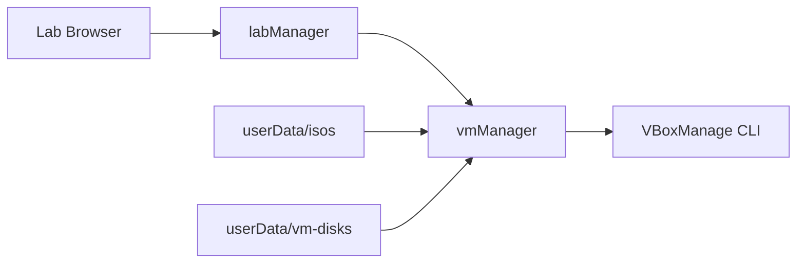

# Creating Labs

This guide explains how to add hands-on labs to **Computer Server Labs**. Labs must be safe, reviewable, and MPL-friendly.

**Authoring in the app:** When **Developer Mode** is on (Settings), the optional [Lab Builder](lab-builder.md) stores **drafts** under `userData/lab-builder/drafts/` with schema + safety checks — separate from bundled catalog labs below.

**Runtime for MVP:** Docker only. Read [security-model.md](security-model.md) and [anti-bricking rules](MVP_STEP_BY_STEP.md#system-safety-and-anti-bricking-rules) first.

## Community content and responsibility

This project is a **community-made educational platform** (not an accredited training provider).

- Lab authors are responsible for safe, reviewable content.
- Learners should only import labs from sources they trust.
- Expect resource usage (CPU/RAM/disk) during builds and lab runs.
- The software is provided **as-is** with no warranty and is not affiliated with Microsoft, Docker, Oracle, VMware, etc.

---

## Folder structure

```text
labs/
  my-lab-001/
    lab.json       # Required — machine-readable definition
    Dockerfile     # Required for docker runtime
    README.md      # Required — human docs + safety notes
    assets/        # Optional — static files copied into image
```

Image tag convention: `sysadmin-game/<lab-id>:latest` (built locally).

---

## `lab.json` overview

```json
{
  "id": "beginner-linux-001",
  "title": "First Linux Login",
  "difficulty": "Easy",
  "category": "Linux Basics",
  "description": "SSH into the server and locate the hidden flag file.",
  "runtime": "docker",
  "docker": {
    "image": "sysadmin-game/beginner-linux-001:latest",
    "buildPath": ".",
    "ports": [{ "container": 22, "host": 2222 }]
  },
  "credentials": {
    "username": "student",
    "host": "127.0.0.1",
    "generatedPerSession": true
  },
  "objectives": [
    { "id": "ssh-ready", "label": "SSH into the lab", "autoCheck": "portOpen", "port": 22 },
    { "id": "lab-complete", "label": "Create /tmp/lab-complete", "autoCheck": "fileExists", "path": "/tmp/lab-complete" }
  ],
  "tasks": ["SSH into the server", "Find the hidden flag file"],
  "hints": ["Use SSH.", "Hidden files often start with a dot."],
  "questions": [],
  "validation": { "type": "fileExists", "path": "/tmp/lab-complete" },
  "xpReward": 100
}
```

Schema validation (AJV) will be enforced in `labManager` — do not add arbitrary executable fields.

---

## Lab unlock requirements (`unlockRequirements`)

Control when a lab appears as **available** vs **locked** in the Lab Browser. Locked labs remain visible to motivate progression.

```json
{
  "unlockRequirements": {
    "minLevel": 3,
    "requiredLabs": ["beginner-linux-001", "permissions-001"],
    "requiredAchievements": ["linux_basics_complete"],
    "recommendedSkills": ["ssh", "nginx"]
  }
}
```

| Field | Purpose |
|--------|---------|
| `minLevel` | Player level from total XP (see `config/app.defaults.json` `levels`) |
| `requiredLabs` | Catalog lab ids the learner must **complete** first |
| `requiredAchievements` | Achievement ids (e.g. `no_hints`, `linux_basics_complete`) |
| `recommendedSkills` | Optional labels shown to authors / future UI hints |

Unlock checks use catalog `lab.json` only — **not** per-session randomized flags, ports, or credentials.

Example progression in the bundled catalog:

- `beginner-linux-001` — level 1
- `permissions-001` — level 2 + complete beginner lab
- `nginx-001` — level 3 + beginner + permissions
- `disk-cleanup-001` — level 4 + beginner + permissions
- `service-repair-001` — level 5

---

## Public objectives vs internal validation (no answer leakage)

Keep **what learners see** separate from **how the app checks success**.

| Field | Audience | Examples |
|--------|-----------|----------|
| `objectivesPublic` | Shown in the lab session UI | “Connect to the training server”, “Locate the hidden training file” |
| `objectives` | Internal only (auto-checks, answer keys) | `path: /tmp/objective-ssh-login`, `answerKey: trainingFlag` |
| `validation` | Internal final gate | `fileExists` on `/tmp/lab-complete` |
| `setupSecrets` | Session-generated values | `trainingFlag`, `flagFilename` |

**Do not** put solution paths, marker filenames, or validation commands in `objectivesPublic` labels, `tasks`, or `hints`.

Learners may answer questions such as “What is the hidden flag filename?” — that is fine. Do not prefill answers or show internal paths in the UI.

Authors with **Developer Mode** and **Show internal lab debug info** (Settings) can inspect internal paths while testing.

Example:

```json
{
  "objectivesPublic": [
    { "id": "ssh-login", "label": "Connect to the training server" },
    { "id": "find-flag", "label": "Locate the hidden training file", "prompt": "What is the hidden flag filename?" },
    { "id": "lab-complete", "label": "Mark the task complete from inside the lab" }
  ],
  "objectives": [
    { "id": "ssh-login", "autoCheck": "fileExists", "path": "/tmp/objective-ssh-login" },
    { "id": "find-flag", "autoCheck": "manual", "answerKey": "flagFilename" },
    { "id": "lab-complete", "autoCheck": "fileExists", "path": "/tmp/lab-complete" }
  ],
  "validation": { "type": "fileExists", "path": "/tmp/lab-complete" },
  "setupSecrets": ["trainingFlag", "flagFilename"]
}
```

---

## Command guide hints and red herrings

Labs may include optional authoring metadata to support troubleshooting learning flow.

### `commandGuide`

```json
{
  "commandGuide": {
    "enabled": true,
    "categories": ["files", "ssh", "permissions"],
    "suggestedCommands": ["ls", "ls -la", "cat", "find", "grep"],
    "redHerrings": ["systemctl status", "df -h", "ip addr"]
  }
}
```

- Suggested commands should be **plausible tools**, not the exact “do X to win” solution.
- `redHerrings` should be plausible but non-required.
- UI mixes them together and does not label which are required.

### `redHerrings`

```json
{
  "redHerrings": [
    { "type": "file", "path": "/home/student/.old_flag", "description": "Decoy hidden file" },
    { "type": "service", "name": "cron", "description": "Unrelated service" }
  ]
}
```

These objects are **design notes** unless your Docker image actually creates them (via Dockerfile/entrypoint).

Red herrings should teach troubleshooting, not trick learners unfairly. Avoid decoys that cause long dead ends.

---

## Dockerfile guidelines

- Base on a minimal official image (e.g. `ubuntu:22.04`)
- Install only what the scenario needs (e.g. `openssh-server`, `nginx`)
- Create the lab user in the Dockerfile; apply the session password at container start via `LAB_USERNAME` / `LAB_PASSWORD` env (see `entrypoint.sh` in starter labs)
- Expose required ports in Dockerfile / `lab.json`
- **Do not** `COPY` from host paths outside the lab folder
- **Do not** require `--privileged` or host devices
- Document how to build manually:

  ```bash
  cd labs/my-lab-001
  docker build -t sysadmin-game/my-lab-001:latest .
  ```

---

## Credentials (required labeling)

**Do not put passwords in `lab.json`.** Use:

```json
"credentials": {
  "username": "student",
  "host": "127.0.0.1",
  "generatedPerSession": true
}
```

The app generates a random password per lab session, stores it under `userData/sessions/`, and passes it to the container as `LAB_PASSWORD`. Entrypoints apply it with `chpasswd`.

In `README.md` and in-app copy:

- State passwords are **lab-only**, **per session**, and **not** for production
- Warn users not to reuse passwords elsewhere
- For manual `docker run`, document `-e LAB_USERNAME=… -e LAB_PASSWORD=…`

See [security-model.md](security-model.md) — passwords must never appear in logs or Discord RPC.

---

## Objectives (auto-tracking)

Optional `objectives` array in `lab.json` powers the session checklist and auto-completion:

```json
"objectives": [
  { "id": "ssh-ready", "label": "SSH into the lab", "autoCheck": "portOpen", "port": 22 },
  { "id": "flag-found", "label": "Find the flag", "autoCheck": "fileExists", "path": "/home/student/.hidden_flag" }
]
```

Supported `autoCheck` values: `manual`, `fileExists`, `command`, `portOpen`, `serviceRunning`.

---

## Validation

Validation runs **inside the container** via whitelisted types:

| Type | Purpose |
|------|---------|
| `command` | Exit code of a fixed command |
| `fileExists` | Path exists in container |
| `serviceRunning` | systemd unit active |
| `httpResponse` | HTTP status from inside/container |
| `portOpen` | TCP check on mapped port |
| `userExists` | Unix user exists |
| `permission` | Mode bits on path |
| `packageInstalled` | dpkg/rpm query |
| `textAnswer` | Quiz match in UI (no docker exec) |

**Forbidden:**

- Host validation
- Shell built from user input
- Downloading and executing scripts from the internet

---

## Safety requirements for new labs

- [ ] `runtime` is `"docker"` for MVP
- [ ] No `privileged`, no host bind mounts in default `lab.json`
- [ ] If a lab truly needs a mount (rare), document why and expect maintainer review + user confirmation
- [ ] Validation paths and commands are fixed strings in JSON
- [ ] README includes isolation and credential warnings
- [ ] No copyrighted ISOs or licensed media in the repo

Labs that request unsafe capabilities should set nothing until `safetyManager` supports explicit flags—and expect **Safety Mode** to block them by default.

---

## Hints and XP

- Put each nudge on **`objectivesPublic[].hint`** for that step — learners reveal hints per objective, not as one global list
- Hints should suggest *approach* (which tool, what to inspect) without copying exact commands, paths, or answers
- Omit `hint` only when a step should have no nudge; legacy top-level `hints[]` still maps by objective order for older labs
- Document suggested `xpReward` and hint penalty behavior (`config/app.defaults.json`)

---

## Difficulty guidelines

| Level | Audience |
|-------|----------|
| Easy | First contact with skill; single service |
| Medium | Multi-step troubleshooting |
| Hard | Multiple services or constraints |
| Expert | Broad integration; longer scenarios |

---

## Submitting a lab

1. Open a [lab submission](../../.github/ISSUE_TEMPLATE/lab_submission.md) issue
2. Open a PR with lab folder + link to issue
3. Confirm PR checklist in [CONTRIBUTING.md](../CONTRIBUTING.md)

---

## Testing your lab

1. `docker build` / `docker run` manually per README
2. SSH from host to mapped port
3. Complete objectives; verify validation command manually inside container
4. `docker rm -f` cleanup

Automated tests may be added later.

---

## VM-based labs (archived — not in current builds)

**Status:** VM support is **not currently included**. The app is Docker-only. The notes below are kept for historical reference only.

Use `runtime: "vm"` with `vm.provider: "virtualbox"`. Docker remains the default for lightweight labs.

Manage templates and ISOs from **VM Manager** ([vm-manager.md](vm-manager.md)). There is no custom hypervisor — only VirtualBox via `VBoxManage`.

### Workstation metadata (`workstation` block)

| Field | Purpose |
|-------|---------|
| `recommended` | Profile id when user picks Auto (e.g. `ubuntu-terminal`, `vm-ubuntu`) |
| `supported` | Allowed profile ids |
| `allowLocalTerminal` | Default `false` — allow host-shell workstation (advanced) |
| `preferDockerWorkstation` | Default `true` — blocks local terminal on Easy labs |
| `vmTemplateRequired` | Require verified local template before VM deploy |

Never recommend `local-terminal` for beginner labs.

### When to prefer Docker vs a VM

| Approach | Prefer when… | Trade-offs |
|----------|----------------|------------|
| **Docker** | Single Linux service, SSH practice, web stacks, file permissions | Fast start, small images, easy reset |
| **VM** | Full desktop OS, multi-boot, hypervisor-specific skills, firmware/BIOS topics | Slower, larger disk/RAM, harder cleanup |

VM labs are **heavier and slower** because they boot full virtual machines, manage virtual disks, and require hypervisor APIs. Docker labs share the host kernel and start in seconds.

### VM architecture (VirtualBox)



Implemented in `src/main/vm/`:

| Concern | Planned behavior |
|---------|------------------|
| **ISO folder** | User-provided `.iso` only under `userData/isos/` |
| **Create VM** | Wizard + lab start: disk in `vm-disks/`, machine under `vms/` |
| **Networking** | NAT by default |
| **Install** | Manual in VirtualBox window (autoinstall planned) |
| **Safety** | Paths confined to app data; resource warning in UI |
| **Cleanup** | Settings → delete failed builds / VM cache |

### Example `lab.json` — VirtualBox

```json
{
  "id": "hypervisor-vbox-001",
  "title": "VirtualBox NAT Troubleshooting",
  "difficulty": "Medium",
  "category": "Virtualization",
  "description": "Install Ubuntu from your ISO, then practice guest networking.",
  "runtime": "vm",
  "vm": {
    "provider": "virtualbox",
    "guestOs": "ubuntu",
    "isoRequired": true,
    "isoMatch": ["ubuntu", "22.04"],
    "memoryMb": 4096,
    "cpuCount": 2,
    "diskGb": 30,
    "networkMode": "nat",
    "setupMode": "manual",
    "viewer": "virtualbox"
  },
  "credentials": { "username": "student", "password": "lab-only" },
  "tasks": ["Verify guest can reach the lab gateway", "Fix misconfigured NAT adapter"],
  "validation": { "type": "portOpen", "port": 22 },
  "xpReward": 200
}
```

### Example future `lab.json` — VMware

```json
{
  "id": "vmware-workstation-001",
  "title": "VMware Tools Recovery",
  "runtime": "vmware",
  "vm": {
    "template": "templates/win-lab.vmx",
    "snapshot": "baseline",
    "memoryMb": 4096,
    "cpus": 2,
    "networkMode": "host-only"
  }
}
```

### Example future `lab.json` — Hyper-V

```json
{
  "id": "hyperv-switch-001",
  "title": "Hyper-V Virtual Switch",
  "runtime": "hyperv",
  "vm": {
    "template": "CSL-Ubuntu-22.04",
    "snapshot": "Checkpoint-Clean",
    "memoryMb": 2048,
    "cpus": 2,
    "networkMode": "internal"
  }
}
```

### Example future `lab.json` — QEMU/KVM

```json
{
  "id": "qemu-bridge-001",
  "title": "KVM Bridge Lab",
  "runtime": "qemu",
  "vm": {
    "template": "qemu/ubuntu-2204.qcow2",
    "snapshot": "clean",
    "memoryMb": 2048,
    "cpus": 2,
    "networkMode": "bridged"
  }
}
```

### How VM labs will differ from Docker labs

| Aspect | Docker lab | VM lab (future) |
|--------|------------|-----------------|
| Boot | Container process | Full OS boot |
| Reset | Recreate container | Revert snapshot |
| Resources | cgroup limits | vCPU/RAM disk quotas |
| Detection | `docker` CLI | Hypervisor-specific tools |
| Validation | `docker exec` | Guest agent or SSH to guest IP |

### Why VM support is not fully implemented yet

- Larger attack surface (hypervisor APIs, disk images, networking)
- Platform-specific code paths (Windows Hyper-V vs Linux KVM)
- Packaging size and legal review for ISOs/OVAs
- Safety Mode needs per-hypervisor policies before automation

Until `vmManager.js` ships, submit **Docker** labs only. VM definitions may be drafted in issues/PRs for schema review without expecting the app to run them.

---

## Related

- [architecture.md](architecture.md)
- [docker-setup.md](docker-setup.md)
- [security-model.md](security-model.md)
